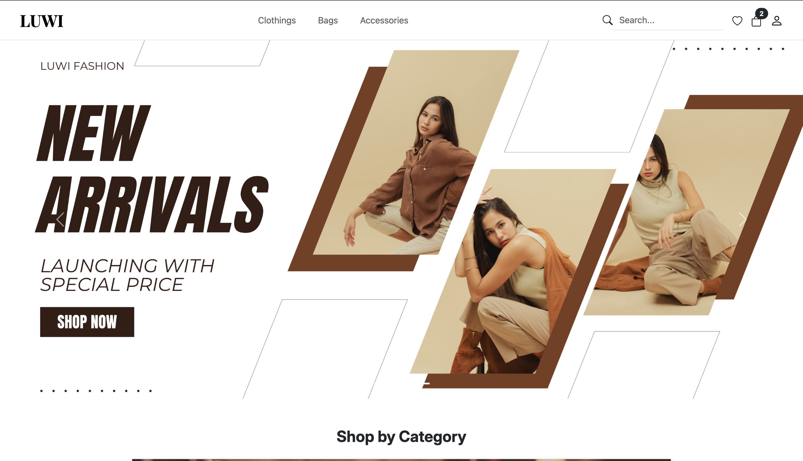

# LUWI — Fashion E-Commerce Website (Front-End)

A static, front-end-only shopping website built for my own fashion brand concept, **LUWI**. This was my first front-end project, built in Semester 1 of my Applied Software Engineering studies in Forward College.


## 🧵 About

LUWI is a fashion brand I created for this project — a clean, minimal clothing and accessories store. The goal was to practice structuring a multi-page website, working with Bootstrap's grid and components, and designing a cohesive UI, without any JavaScript or backend logic.

## ✨ Features

- Responsive navbar with search bar, wishlist icon, cart icon (with item-count badge), and an account dropdown (Login / Sign Up UI)
- Homepage hero banner
- "Shop by Category" section — Clothings, Bags, Accessories
- New Arrivals section
- Dedicated **Wishlist** page
- Dedicated **Cart** page
- Fully responsive layout using Bootstrap's grid system

## 🛠️ Built With

- HTML5
- CSS3
- Bootstrap 5

## 📄 Pages

| Page | File | Description |
|---|---|---|
| Home | `index.html` | Hero banner, category showcase, new arrivals |
| Cart | `cart.html` | Shopping cart UI |
| Wishlist | `wishlist.html` | Saved items UI |

> Category pages (Clothings, Bags, Accessories) and a product detail page are part of the planned site structure but are not yet built out — their nav links are placeholders for now.

## 🚧 Limitations & What's Next

Since this project uses HTML/CSS/Bootstrap only:
- Cart, wishlist, and login/sign-up are static UI — not functionally wired up
- Category and product detail pages are planned but not yet implemented
- A future version will add JavaScript for interactivity, and a backend (e.g. PHP) for real cart/auth logic

## 📸 Screenshots

<!-- Add screenshots here, e.g.: -->
<!--  -->

## 🚀 Getting Started

```bash
git clone https://github.com/selfiirawan/luwi.git
cd luwi
```

Then just open `index.html` in your browser — no build step or dependencies needed.

## 👩‍💻 Author

**Selfi** — [@selfiirawan](https://github.com/selfiirawan)
